
<h1 align="center">基于的医护人员排班系统</h1>

## 简介
医护人员排班系统：角色包括管理员、医生、护士；功能涵盖医院信息管理、医护人员信息管理、排班管理、科室管理、投诉处理和论坛互动。这款系统通过简洁的界面实现有效的排班和医疗资源管理。    --计算机毕业设计源码；毕设源码；java毕业设计源码

## 联系方式

<h3 align="center">获取完整代码与数据库文件 + 微信：deepguan QQ: 86050149 QQ群: 783742310</h3>

<h3 align="center">可帮忙远程部署 包运行成功！提供远程部署、修改代码、设计文档指导、代码讲解等服务！</h3>

## 功能介绍（完整见运行截图）
管理员： 基本功能包括登录、注册和退出，同时可以访问个人中心查看与修改个人信息。系统提供医院信息管理、医护信息管理、科室信息管理及排班信息管理等模块，帮助管理员处理医院基本信息、管理医护人员、安排排班并处理相关投诉。管理员可以进行信息的录入与审核，上传医院相关文件，设置排班类型，进行医护类别管理，通过后台管理实现对整个系统功能的操控。系统还具备处理用户投诉、管理讨论论坛和查看用户反馈等多个功能模块，以确保系统的平稳运行。

医护人员： 系统支持医护人员登录、注册和退出功能，提供个人中心相应信息修改的功能。医护人员可以查看排班信息，更新个人资料，包括上传头像及修改联系方式，查看所属科室和医院的具体安排，参与对论坛的讨论和投诉信息的提交。通过系统的排班信息管理功能，医护人员可以及时掌握自己的工作安排及班次调整。同时，医护人员角色还可以通过留言和评论功能与管理员或其他用户沟通交流，以便更高效地协调工作和调整需求。

患者： 用户可以通过系统登录、注册和退出，查看医院及科室的详细信息，包括医生及护士的排班安排和联系方式。在个人中心，患者可以进行信息管理，调整个人设置。系统的投诉模块允许患者对服务进行反馈和投诉，并与后台管理员互动。在论坛中，患者可以发表和参与讨论，获取其他人的经验和建议。此外，患者能够通过系统的收藏功能保存感兴趣的医生或服务，以便后续的快捷访问。

医生/护士： 系统提供医生和护士的登录、注册、退出功能，并允许用户管理其个人信息和排班时间。通过检查排班模块，医生和护士可以查看和调整自己的工作日程。系统的科室管理功能使他们能够确认所属科室的工作计划，并了解其他医生的排班信息，以便协同工作。论坛模块提供医生和护士交流想法和经验的平台，反馈功能让他们能够与管理员就系统或排班中的问题进行沟通，提高工作效率和服务质量。

## 运行截图

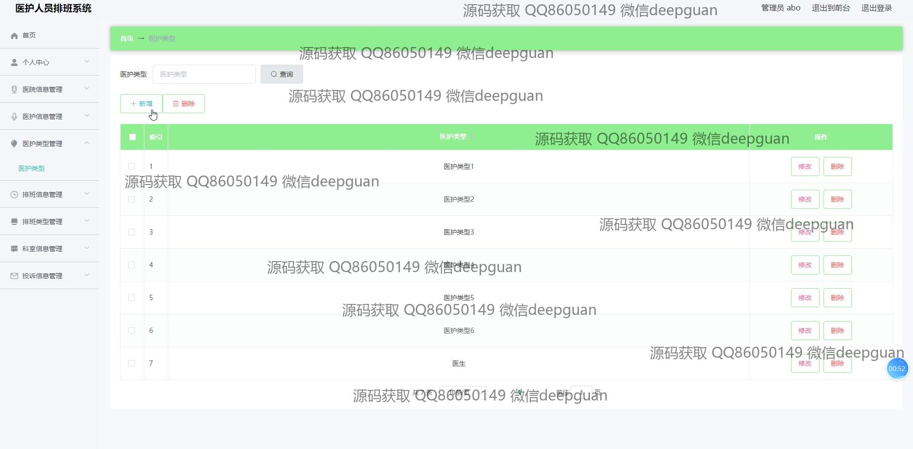
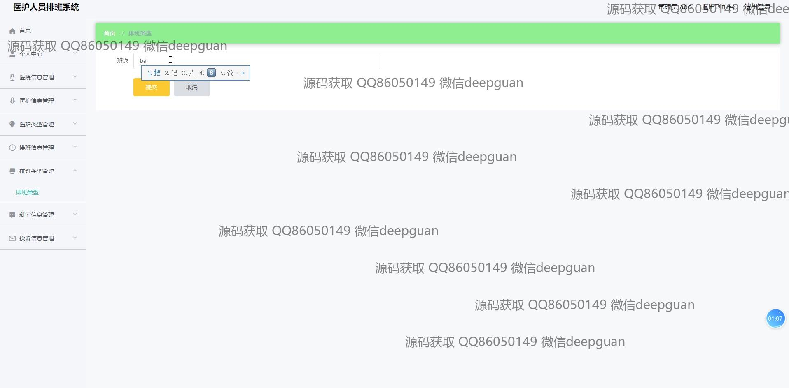
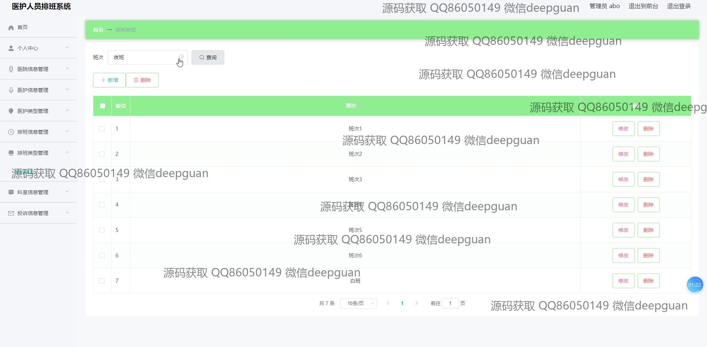

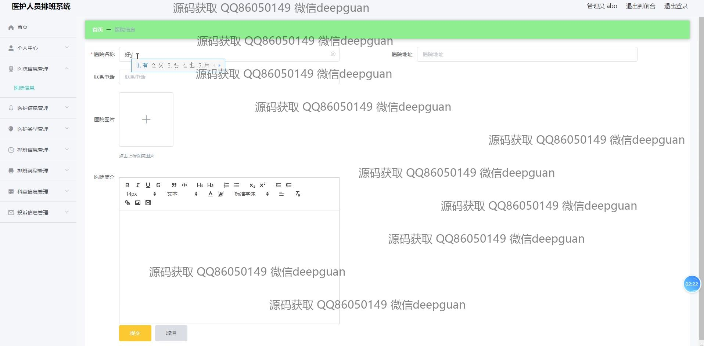
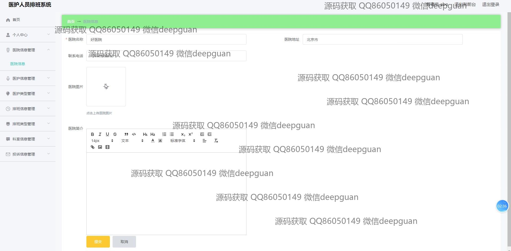

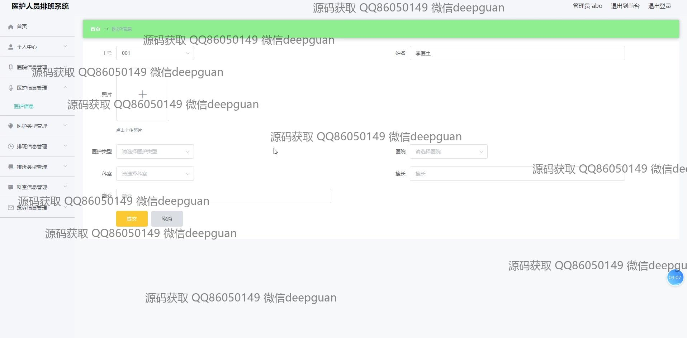

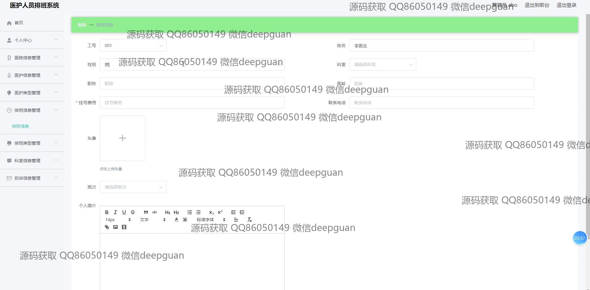
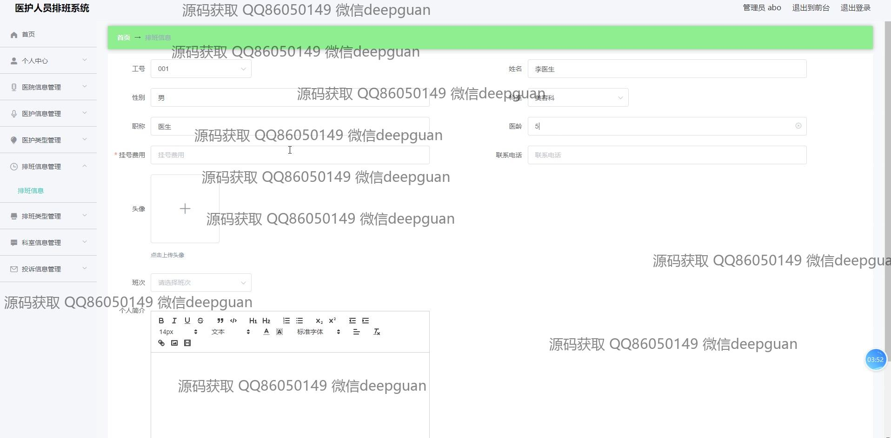
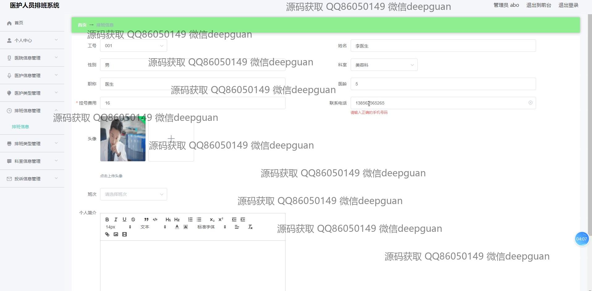

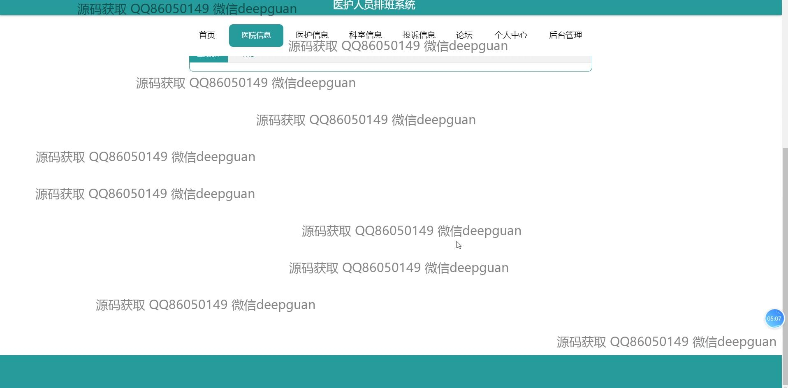
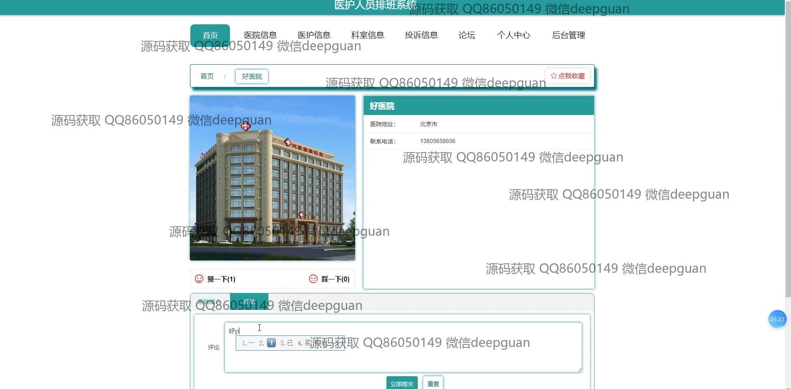
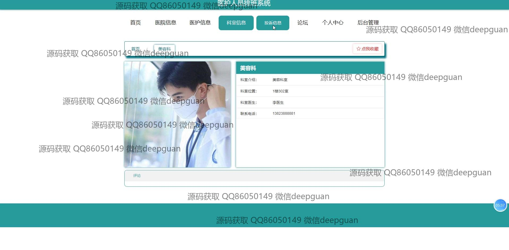

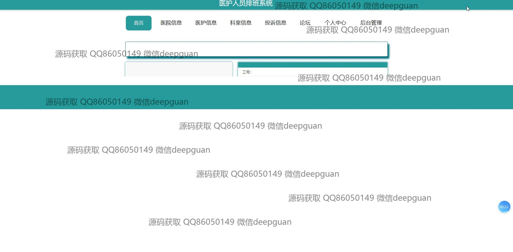
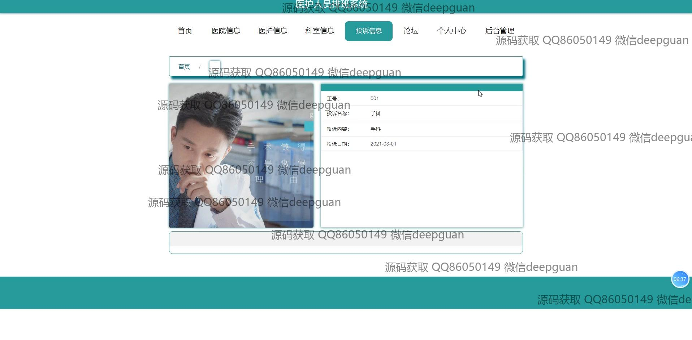

本代码来源于网络,仅供学习参考使用!

